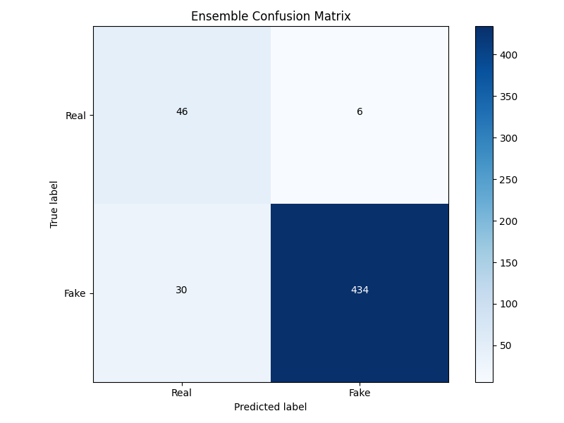
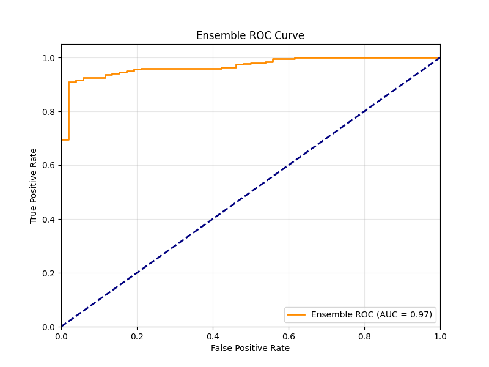

```markdown
# 🛡️ DeepGuard AI - Deepfake Detection System

[](https://www.python.org/)
[](https://pytorch.org/)
[](https://flask.palletsprojects.com/)
[](LICENSE)

A production-ready deepfake detection system using **CNN-LSTM architecture with attention mechanism** and **smart ensemble voting**. Achieves **93.4% accuracy** on the DFD dataset.

---

## 🎯 Key Features

- 🧠 **CNN-LSTM Architecture** – EfficientNet-B0 for spatial features + Bi-LSTM for temporal patterns  
- 🔍 **Attention Mechanism** – Learns which frames are most important  
- 🤖 **Smart Ensemble Voting** – 3-model ensemble with 93.4% accuracy  
- 🚀 **Real-time Detection** – 2–5 seconds per video (GPU)  
- 🌐 **Web Interface** – Interactive UI with model switching  
- 📊 **Evaluation Metrics** – Confusion matrix, ROC curve, classification report  

---

## 📊 Performance Results

| Model | Accuracy | AUC |
|------|---------|-----|
| Model A | 89.5% | 0.910 |
| Model B | 94.0% | 0.971 |
| Model C | 92.4% | 0.975 |
| **Ensemble (Smart)** | **93.4%** | **0.969** |

### Test Set (516 Videos)

| Metric | Real | Fake |
|--------|------|------|
| Precision | 61% | 99% |
| Recall | 88% | 94% |
| F1-Score | 72% | 96% |

---

## 🏗️ Architecture Overview

```

Input Video → Face Detection (MTCNN) → Frame Sampling (20 frames)
↓
Spatial Features (EfficientNet-B0)
↓
Temporal Modeling (Bi-LSTM + Attention)
↓
Smart Ensemble (3 Models)
↓
Output: REAL / FAKE (with confidence)

````

---

## 🚀 Quick Start

### 🔧 Prerequisites
- Python 3.8+
- CUDA GPU (recommended)
- 8GB+ RAM

### ⚙️ Installation

```bash
git clone https://github.com/johnvarshith/deepguard-ai.git
cd deepguard-ai

python -m venv venv

# Activate environment
# Windows:
venv\Scripts\activate
# Linux/Mac:
source venv/bin/activate

pip install -r requirements.txt
````

---

### 📥 Download Pretrained Models

Download from:
👉 [https://github.com/johnvarshith/deepguard-ai/releases](https://github.com/johnvarshith/deepguard-ai/releases)

Place inside `/models`:

* `deepfake_model_ensemble_A.pth`
* `deepfake_model_ensemble_B.pth`
* `deepfake_model_ensemble_C.pth`

---

### ▶️ Run Web App

```bash
python webapp/app.py
```

Open:
👉 [http://localhost:5000](http://localhost:5000)

---

## 📁 Project Structure

```
deepguard-ai/
│
├── models/
│   ├── cnn_lstm_model.py
│   ├── ensemble_3models.py
│   └── ensemble_2models.py
│
├── webapp/
│   ├── app.py
│   ├── templates/
│   │   ├── index.html
│   │   ├── result.html
│   │   ├── about.html
│   │   ├── documentation.html
│   │   └── settings.html
│   └── uploads/
│
├── preprocessing/
│   ├── face_detection.py
│   ├── extract_faces.py
│   └── data_loader.py
│
├── training/
│   ├── train_ensemble.py
│   ├── evaluate_ensemble.py
│   └── outputs/
│
├── utils/
│   └── video_utils.py
│
├── requirements.txt
└── README.md
```

---

## 🧪 Training Your Own Models

```bash
# Extract faces
python preprocessing/extract_faces.py

# Train ensemble
python training/train_ensemble.py

# Evaluate
python training/evaluate_ensemble.py
```

---

## 📡 API Endpoints

### 🔹 POST `/api/predict`

```bash
curl -X POST http://localhost:5000/api/predict \
  -F "video=@video.mp4"
```

#### Response:

```json
{
  "success": true,
  "prediction": "FAKE",
  "confidence": 85.5,
  "probability": 0.927,
  "filename": "video.mp4",
  "model_used": "3-Model Ensemble (Smart)"
}
```

---

### 🔹 GET `/api/stats`

Returns model performance statistics.

---

## 🖼️ Results

### Confusion Matrix



### ROC Curve



---

## 📊 Dataset

* **Dataset**: Google DFD (Deepfake Detection)
* **Total Videos**: 3,431

  * Real: 363
  * Fake: 3,068
* **Scenes**: 16
* **Resolution**: 128×128
* **Frames per video**: 20

---

## 🛠️ Tech Stack

| Category        | Tools                                  |
| --------------- | -------------------------------------- |
| Deep Learning   | PyTorch, EfficientNet, LSTM, Attention |
| Computer Vision | OpenCV, MTCNN                          |
| Backend         | Flask                                  |
| Frontend        | Tailwind CSS                           |
| GPU             | CUDA (RTX 3050)                        |

---

## 📈 Future Improvements

* [ ] Add Celeb-DF & FaceForensics++
* [ ] Transformer-based architecture
* [ ] Audio-based detection
* [ ] Cloud deployment (AWS/GCP)
* [ ] Mobile integration

---

## 📝 License

MIT License – see `LICENSE`

---

## 👨‍💻 Author

**John Varshith**

* GitHub: [https://github.com/johnvarshith](https://github.com/johnvarshith)
* Email: [johnvarshith2004@gmail.com](mailto:johnvarshith2004@gmail.com)
* LinkedIn: [https://linkedin.com/in/johnvarshith](https://linkedin.com/in/johnvarshith)

---

## 🙏 Acknowledgments

* Google/Jigsaw DFD Dataset
* FaceNet-PyTorch (MTCNN)
* PyTorch Team

---

⭐ **Star this repo if you found it useful!**

```

---

If you want, I can **make it even more impressive for recruiters** (add badges like downloads, demo GIF, architecture diagram, or deployment link).
```
